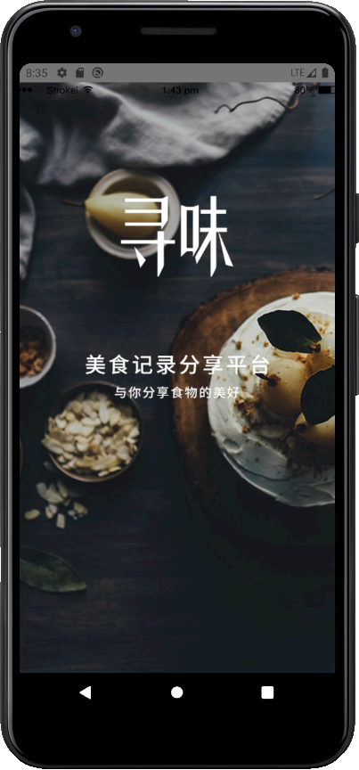

<!--
 * @Author: your name
 * @Date: 2019-11-21 16:19:24
 * @LastEditTime: 2019-11-21 16:40:29
 * @LastEditors: Please set LastEditors
 * @Description: In User Settings Edit
 * @FilePath: \xunwei_rn\README.md
 -->
## 寻味 - RN
- xunwei-rn基于react-native、ant-design-mobile-rn、mobx-react、mock、axios构建开发的跨平台APP，APP主题思想主要是寻找美食
- JAVA JDK版本：java version "1.8.0_152"
- ANDROID SDK版本：28
- nodejs 版本：v10.16.0
- android端成功完美运行，ios端未曾运行（但是UI用了跨平台，实际上ios运行起来问题不大）

